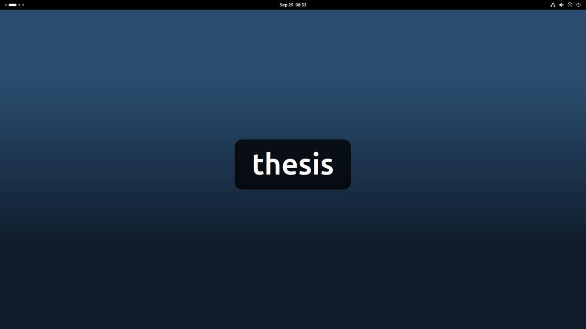
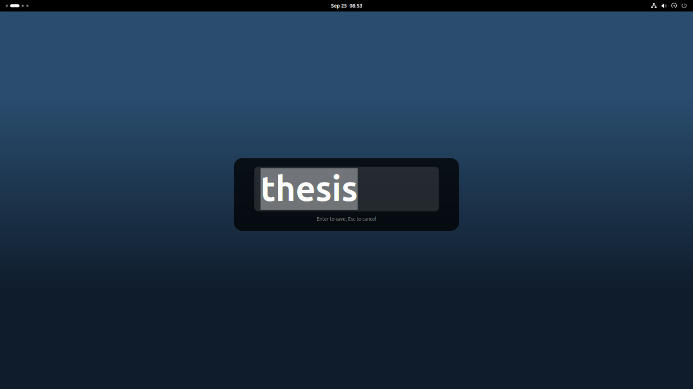

# Workspace Name OSD

A GNOME Shell extension that shows the name of the workspace in big letters in the middle of the screen every time you switch, so you always know where you landed. You can also bring the name up whenever you like, and rename the workspace right there.



## Using it

Switch workspaces as usual (Ctrl+Alt+Left/Right, Super+Page Up/Down, or the overview) and the name appears for about a second. It also shows over fullscreen windows.

Press **Super+F2** to see the name of the current workspace without switching.

To rename, click the name while it is on screen, or press Super+F2 a second time. Type the new name and press Enter to keep it. Esc, or a click anywhere else, leaves the old name alone.



### Several monitors

The name shows in the middle of every monitor. Renaming happens on one of them only. A click edits on the monitor you clicked, and Super+F2 edits on the monitor with the mouse pointer. The other monitors keep showing the saved name until you press Enter, and a click on any of them counts as a click outside, so it cancels.

By default GNOME only switches workspaces on the primary monitor (the `workspaces-only-on-primary` setting of `org.gnome.mutter`). The other monitors then keep the same windows whatever the workspace, but they still show the name of the workspace you are on, which is the one the primary monitor shows. To have the name on one monitor only (the one with the pointer), turn off `all-monitors`.

The names are kept in GNOME's own `workspace-names` setting, so they survive reboots and show up in anything else that reads them. GNOME ties a name to a position (the second workspace from the left), not to the windows on it. With dynamic workspaces GNOME removes a workspace once it is empty, and the ones after it move along. The extension moves their names with them, so each workspace keeps its own name and the removed one's name is dropped. The same happens when you drop a window between two workspaces in the overview to create a new one there. The new workspace starts unnamed and the ones after it keep theirs.

Removing the last workspace, or adding one at the end, leaves the names alone. A new workspace at the end takes the name stored for its position, which is how your names come back after a restart. While the extension is disabled (for example while the screen is locked) it cannot see workspaces change, so names can end up on the wrong workspace if one is removed in that time.

## Installing

GNOME 50 only for now (tested on Ubuntu 26.04).

```bash
git clone https://github.com/nkyriazis/workspace-name-osd.git
cd workspace-name-osd
make install
```

Or download the zip attached to the [latest release](https://github.com/nkyriazis/workspace-name-osd/releases/latest) and install that.

```bash
gnome-extensions install --force workspace-name-osd@nkyriazis.github.com.shell-extension.zip
```

Log out and back in so GNOME Shell picks up the new extension (on Wayland there is no other way), then turn it on.

```bash
gnome-extensions enable workspace-name-osd@nkyriazis.github.com
```

### If nothing shows up

Check what GNOME thinks of the extension.

```bash
gnome-extensions info workspace-name-osd@nkyriazis.github.com
```

If it says `Enabled: Yes` but `State: INITIALIZED` rather than `ACTIVE`, all user-installed extensions are switched off. This is the "Extensions" toggle in the Extensions app, and Ubuntu sometimes sets it after an upgrade. Turn them back on (no logout needed) with

```bash
gsettings set org.gnome.shell disable-user-extensions false
```

If it is `ACTIVE` and still nothing appears, watch the log while switching workspaces.

```bash
journalctl --user -f -o cat | grep -iE "workspace-name|JS ERROR"
```

## Updating

Extensions installed from GitHub don't update by themselves. To hear about new versions, click Watch on the GitHub page, choose Custom and tick Releases. What changed in each version is in [CHANGELOG.md](CHANGELOG.md).

With the repo

```bash
cd workspace-name-osd
git pull
make install
```

or with the zip from the release, using the same `gnome-extensions install --force` command as above.

Then log out and back in. GNOME Shell keeps running the old version until you do, and on Wayland there is no way to reload it.

## Uninstalling

```bash
make uninstall
```

or, without the repo

```bash
gnome-extensions uninstall workspace-name-osd@nkyriazis.github.com
```

This turns the extension off and deletes it straight away, no logout needed. Its own settings (shortcut, size, timings) are left behind in dconf, and this clears them.

```bash
dconf reset -f /org/gnome/shell/extensions/workspace-name-osd/
```

Your workspace names belong to GNOME rather than to the extension, so uninstalling keeps them. To clear those as well

```bash
gsettings reset org.gnome.desktop.wm.preferences workspace-names
```

## Settings

There is no preferences window yet. All settings apply immediately, without logging out.

| Key | Default | What it does |
|---|---|---|
| `show-name` | `['<Super>F2']` | Shortcut to show the name, and to rename when pressed again |
| `font-size` | `96` | Size of the name in pixels |
| `switch-hold-ms` | `900` | How long the name stays up after a switch |
| `demand-hold-ms` | `2500` | How long it stays up after the shortcut |
| `all-monitors` | `true` | Show the name on every monitor, rather than only on the one with the pointer |

For example, to make the name bigger

```bash
gsettings --schemadir ~/.local/share/gnome-shell/extensions/workspace-name-osd@nkyriazis.github.com/schemas \
  set org.gnome.shell.extensions.workspace-name-osd font-size 140
```

## Development

Changes to an extension normally take a logout to load, which makes testing slow. The scripts here start a separate GNOME Shell with no window (headless, with a virtual 1920×1080 monitor) and throwaway settings, load the extension from this folder, and drive it with simulated keyboard and mouse input. Your own desktop and workspace names are never touched.

```bash
make test          # run the checks, once with one monitor and once with three
make shots         # regenerate the screenshots in docs/
make shots-multi   # the same with three monitors, into docs/pr-evidence/all-monitors/
```

`tests/run.sh` takes the monitors from `WSOSD_MONITORS`, for example `WSOSD_MONITORS="1920x1080 1280x1024" tests/run.sh`.

### Releasing

Releases come from merged pull requests. Every PR is checked and tested on GitHub (the tests run in an Ubuntu 26.04 container, since that is where GNOME Shell 50 is packaged). A PR that changes anything in the extension folder must raise `version-name` in metadata.json and add a matching `## N (date)` entry to CHANGELOG.md, or the check fails. Changes to docs or tests alone need neither.

When such a PR is merged, CI builds the zip with `make pack`, tags the commit `vN`, and publishes a GitHub release with the zip attached and the changelog entry as its notes. Upload that zip to [extensions.gnome.org](https://extensions.gnome.org/upload/) to reach everyone who installed from there. GNOME checks for updates once a day and installs them at the next login.

People who update keep running the old code until they log out, but GNOME reloads the stylesheet and settings schema from disk every time the extension is turned back on, which happens at every unlock. So a release must never rename a CSS class or remove or retype a settings key, only add new ones. Otherwise the old code meets the new files after an unlock and the name shows up unstyled or not at all.

[docs/how-it-works.md](docs/how-it-works.md) walks through the code.

## License

GPL-2.0-or-later. See [LICENSE](LICENSE).
